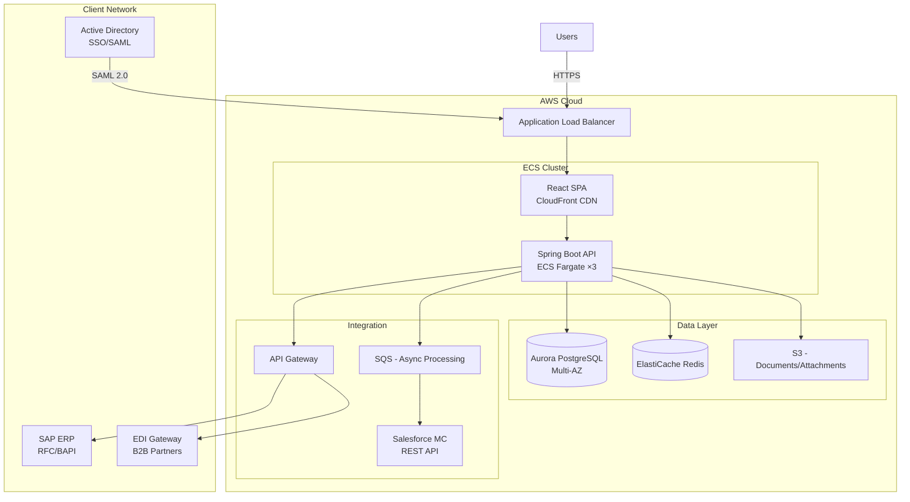

# IT Consulting Expert Plugin — Dry Run Results

## Standard Scenario

**Client**: ABC Manufacturing Corp (ABC製造株式会社)
**Industry**: Large Japanese manufacturer (東京都, 従業員3,000名)
**Project**: Legacy on-premise CRM system migration to cloud-based CRM
**RFP Budget Indication**: ~¥200,000,000
**Timeline Expectation**: 18 months from contract signing
**Submission Deadline**: 2026/07/31
**Presentation Date**: 2026/08/15
**Contract Type**: Fixed-price (一括請負)

### Simulated RFP Key Requirements
- Migrate 500K customer records from legacy Oracle-based CRM
- Web + mobile interface for 800 internal sales/support users
- Integration with SAP ERP (existing), Salesforce Marketing Cloud, and EDI partners
- 99.9% availability SLA, < 2 second response time
- ISMS/ISO27001 compliance required
- Waterfall methodology preferred
- On-premise or hybrid cloud (AWS preferred, Azure acceptable)

---

## Skill 1: RFP Analysis (案件評価・提案可否判断)

**Trigger**: "Should we bid on this ABC Manufacturing CRM RFP?"

### Output

**Deal Summary**

| Field | Value |
|-------|-------|
| Client | ABC Manufacturing Corp |
| Project | CRM Migration to Cloud |
| Estimated Value | ¥200,000,000 |
| Submission Deadline | 2026/07/31 |
| Contract Type | Fixed-price |
| Duration | 18 months |

**Dimension Scoring**

| Dimension | Score (1-5) | Weight | Weighted | Assessment |
|-----------|-------------|--------|----------|------------|
| Strategic Fit (戦略適合性) | 4 | 15% | 0.60 | Manufacturing is a target industry; large account with follow-on potential (maintenance, Phase 2 mobile) |
| Capability Match (技術適合性) | 4 | 25% | 1.00 | Strong in cloud migration, CRM, SAP integration; minor gap in EDI — fillable via partner |
| Win Probability (受注確度) | 3 | 25% | 0.75 | No incumbent advantage; level playing field; our SAP integration track record is a differentiator |
| Commercial Viability (収益性) | 3 | 20% | 0.60 | ¥200M fixed-price is workable at ~18% margin if estimate holds; risk premium needed for data migration |
| Risk Profile (リスク) | 3 | 15% | 0.45 | 500K record migration is moderate risk; legacy Oracle system may have undocumented business logic |
| **Total** | | **100%** | **3.40** | |

**Go/No-Go Recommendation: GO (条件付き)**

Conditions:
1. Confirm EDI partner availability before commitment
2. Request pre-proposal client meeting to assess legacy system data quality
3. Budget 20% risk contingency for data migration unknowns
4. Assign senior PM with manufacturing sector experience

**Proposal Investment Estimate**: 3 weeks, 4 senior staff = ~6人月 proposal effort

---

## Skill 2: Create Proposal (提案書作成)

**Trigger**: "Create a proposal for the ABC Manufacturing CRM RFP"

### Output (Document Structure)

**提案書 — ABC製造株式会社 御中**
**顧客関係管理システム クラウド移行プロジェクト ご提案書**

**1. ご提案概要 (Executive Summary)**

ABC製造様の現行CRMシステムをクラウド基盤へ移行し、営業・サポート800名の業務効率を向上させるソリューションをご提案いたします。AWS基盤上にモダンWebアプリケーションを構築し、SAP ERP連携・EDIパートナー連携を維持しながら、99.9%の可用性と2秒以内の応答性能を実現します。

| 項目 | 内容 |
|------|------|
| プロジェクト期間 | 18ヶ月 (2026/10 — 2028/03) |
| 総工数 | 132人月 |
| ご提案金額 | ¥198,000,000 (税別) |
| 開発方法論 | ウォーターフォール |
| 体制 | 15名 (ピーク時) |

**2. お客様の課題認識 (Understanding of Client Needs)**
- [RFP] 現行Oracle CRMの保守期限切れに伴うリスク
- [RFP] 営業現場からのモバイルアクセス要望
- [RFP] SAP ERPとのリアルタイム連携維持の必要性
- [Proposed] レガシーデータのクレンジングによる顧客データ品質の向上

**3. ご提案ソリューション (Proposed Solution)**
- AWS上のコンテナ基盤 (ECS/Fargate)
- React + TypeScript フロントエンド (レスポンシブ対応)
- Java Spring Boot バックエンド (API Gateway経由)
- PostgreSQL (Aurora) + Redis キャッシュ
- SAP連携: RFC/BAPI via SAP Cloud Connector
- 50万件データ移行: ETLツール + カスタムバリデーション

**4-10. (Additional sections as per proposal-format.md template)**
- 技術アーキテクチャ、プロジェクト体制、工数・コスト、スケジュール、品質管理計画、リスク管理、保守運用提案

---

## Skill 3: Team Composition (チーム構成)

**Trigger**: "Propose a team for the ABC Manufacturing CRM project"

### Output

**Team Structure (プロジェクト体制図)**

```
[ABC Manufacturing]
├── Client PM (情報システム部 部長)
├── Client Business Owners (営業部, CS部)
└── Client IT Staff (2名, 既存システム知見)

[Our Company — Prime Contractor]
├── Project Manager (PM) ×1 — Senior, 12y exp, manufacturing sector
├── Technical Lead (TL) ×1 — Senior, 10y exp, AWS + Java architect
├── Business Analyst (BA) ×1 — Mid-Senior, CRM domain expertise
├── System Engineer (SE) ×3 — Mid, Java/React development
├── Programmer (PG) ×3 — Mid-Junior, implementation
├── QA Engineer ×2 — Mid, test automation
├── Infrastructure Engineer ×1 — Senior, AWS certified
├── Data Migration Specialist ×1 — Mid-Senior, ETL + Oracle
└── UX/UI Designer ×1 — Mid, responsive design

[Subcontractor — EDI Partner]
└── EDI Integration Engineer ×1 — Senior, EDI/B2B gateway
```

**Staffing Summary**

| Role | Count | Seniority | Monthly Rate (¥) | Ramp-Up | Duration |
|------|-------|-----------|------------------|---------|----------|
| PM | 1 | Expert (15y) | 1,800,000 | Month 1 | 18 months |
| TL | 1 | Senior (10y) | 1,300,000 | Month 1 | 18 months |
| BA | 1 | Mid-Senior (8y) | 1,000,000 | Month 1 | 12 months |
| SE | 3 | Mid (5y avg) | 800,000 | Month 2 | 14 months |
| PG | 3 | Mid-Junior (3y) | 600,000 | Month 4 | 10 months |
| QA | 2 | Mid (5y) | 650,000 | Month 6 | 10 months |
| Infra | 1 | Senior (8y) | 1,100,000 | Month 1 | 16 months |
| Data Migration | 1 | Mid-Senior (7y) | 950,000 | Month 3 | 8 months |
| UX/UI | 1 | Mid (4y) | 750,000 | Month 1 | 8 months |
| EDI Eng (Sub) | 1 | Senior (10y) | 1,000,000 | Month 8 | 6 months |
| **Total** | **15** | | | | |

**Seniority Mix**: Senior 27% / Mid 46% / Junior 27% — within recommended range.

---

## Skill 4: Effort Estimation (工数見積)

**Trigger**: "Estimate effort for the CRM migration project"

### Output

**Method**: WBS-based (工数積み上げ) — appropriate for fixed-price SIer contract.

**WBS Summary by Phase**

| Phase | Japanese | Man-Months | Duration | % of Total |
|-------|----------|-----------|----------|------------|
| Requirements Definition | 要件定義 | 12.0 | 2.5 months | 11% |
| Basic Design | 基本設計 | 18.0 | 3.0 months | 16% |
| Detailed Design | 詳細設計 | 16.0 | 2.5 months | 14% |
| Implementation | 製造 | 28.0 | 3.5 months | 25% |
| Integration Testing | 結合テスト | 14.0 | 2.0 months | 13% |
| System Testing | 総合テスト | 12.0 | 2.0 months | 11% |
| Deployment & Migration | 移行・リリース | 6.0 | 1.5 months | 5% |
| **Subtotal** | | **106.0** | | |
| PM Overhead (15%) | PM工数 | 16.0 | 18 months | — |
| Risk Buffer (10%) | バッファ | 10.0 | — | — |
| **Grand Total** | | **132.0人月** | **18 months** | **100%** |

**Key Estimation Drivers (from RFP)**
- 500K record data migration: +8人月 (complex cleansing/validation)
- SAP ERP integration (RFC/BAPI): +6人月 (3 integration points)
- EDI partner integration: +4人月 (2 EDI formats)
- Mobile responsive UI: +4人月 (additional testing/design)
- ISMS compliance documentation: +3人月

**Adjustment Factors Applied**
| Factor | Multiplier | Rationale |
|--------|-----------|-----------|
| Technology maturity | 1.0 | Proven stack (Java, React, AWS) |
| Team experience | 0.95 | Experienced team, similar past projects |
| Requirements stability | 1.10 | Legacy system may have undocumented rules |
| Integration complexity | 1.15 | SAP + EDI + Marketing Cloud |
| **Combined** | **1.07** | Applied to base estimate |

---

## Skill 5: Cost Estimation (費用見積)

**Trigger**: "Calculate cost for the CRM project"

### Output

**Labor Cost Breakdown**

| Role | Monthly Rate (¥) | Man-Months | Subtotal (¥) |
|------|-----------------|-----------|--------------|
| PM (Expert) | 1,800,000 | 18.0 | 32,400,000 |
| TL (Senior) | 1,300,000 | 18.0 | 23,400,000 |
| BA (Mid-Senior) | 1,000,000 | 12.0 | 12,000,000 |
| SE ×3 (Mid) | 800,000 | 42.0 | 33,600,000 |
| PG ×3 (Mid-Junior) | 600,000 | 30.0 | 18,000,000 |
| QA ×2 (Mid) | 650,000 | 20.0 | 13,000,000 |
| Infra (Senior) | 1,100,000 | 16.0 | 17,600,000 |
| Data Migration (Mid-Senior) | 950,000 | 8.0 | 7,600,000 |
| UX/UI (Mid) | 750,000 | 8.0 | 6,000,000 |
| EDI Eng — Sub (Senior) | 1,000,000 | 6.0 | 6,000,000 |
| **Labor Total** | | **178.0** | **¥169,600,000** |

**Non-Labor Costs**

| Category | Monthly (¥) | Duration | Total (¥) |
|----------|------------|----------|-----------|
| AWS (dev/staging/prod) | 600,000 | 18 months | 10,800,000 |
| CI/CD + monitoring tools | 100,000 | 18 months | 1,800,000 |
| Licenses (dev tools, IDE) | 50,000 | 18 months | 900,000 |
| Travel (出張費) | — | — | 2,000,000 |
| Data migration tools | — | lump sum | 1,500,000 |
| **Non-Labor Total** | | | **¥17,000,000** |

**Cost Summary**

| Item | Amount (¥) |
|------|-----------|
| Labor Cost | 169,600,000 |
| Non-Labor Cost | 17,000,000 |
| **Total Cost** | **186,600,000** |
| Risk Premium (6%) | 11,400,000 |
| **Proposed Price** | **¥198,000,000** |
| **Gross Margin** | **5.8%** |

**Note**: Margin is thin for fixed-price. Mitigation: negotiate scope boundaries clearly at contract signing, ensure CR process for any additions beyond RFP scope.

**RFP Budget Fit**: ¥198M vs. client indication of ¥200M — within budget with ¥2M headroom.

---

## Skill 6: Technical Solution (技術提案)

**Trigger**: "Design the technical solution for ABC Manufacturing CRM"

### Output

**Solution Architecture Overview**



**Technology Stack Selection**

| Layer | Selected | RFP Requirement | Rationale |
|-------|----------|-----------------|-----------|
| Cloud | AWS | AWS preferred [RFP] | Client preference; our AWS Advanced Partner status |
| Frontend | React 18 + TypeScript | Responsive web + mobile [RFP] | Component ecosystem, mobile-responsive, team expertise |
| Backend | Java 21 + Spring Boot 3 | Not specified | SAP integration maturity, enterprise-grade, large talent pool |
| Database | Aurora PostgreSQL | Not specified (Oracle legacy) | Cost-effective, AWS-native, excellent performance |
| Cache | ElastiCache Redis | < 2sec response [RFP] | Sub-millisecond reads for frequently accessed customer data |
| Auth | AWS Cognito + SAML | Active Directory SSO [RFP] | Native SAML integration with client AD |
| Integration | AWS API Gateway + SQS | SAP, EDI, SFMC [RFP] | Managed API gateway with throttling; async for non-critical paths |

**NFR Compliance**

| Requirement | RFP Target | Solution Design | Achieved |
|------------|-----------|----------------|----------|
| Availability | 99.9% | Multi-AZ Aurora + ECS auto-scaling | Yes |
| Response Time | < 2 seconds | Redis cache + CDN + optimized queries | Yes |
| Security | ISMS/ISO27001 | WAF, encryption at rest/transit, VPC isolation | Yes |
| Data Migration | 500K records | ETL pipeline with validation + rollback capability | Yes |
| Scalability | 800 concurrent users | ECS auto-scaling 3-10 containers | Yes |

---

## Skill 7: Project Delivery (プロジェクト計画)

**Trigger**: "Plan the project delivery methodology"

### Output

**Methodology**: Waterfall (ウォーターフォール) — per RFP requirement.

**Phase Plan**

| Phase | Japanese | Start | End | Duration | Gate Criteria |
|-------|----------|-------|-----|----------|---------------|
| Requirements | 要件定義 | 2026/10 | 2026/12 | 2.5M | 要件定義書 approved by client |
| Basic Design | 基本設計 | 2027/01 | 2027/03 | 3.0M | 基本設計書 + architecture review |
| Detailed Design | 詳細設計 | 2027/04 | 2027/06 | 2.5M | 詳細設計書 + DB design freeze |
| Implementation | 製造 | 2027/05 | 2027/08 | 3.5M | Code complete + unit tests pass |
| Integration Test | 結合テスト | 2027/09 | 2027/10 | 2.0M | IT report + defect closure |
| System Test | 総合テスト | 2027/11 | 2027/12 | 2.0M | UAT sign-off by client |
| Data Migration | データ移行 | 2028/01 | 2028/02 | 1.5M | Migration verification complete |
| Go-live | 本番稼働 | 2028/03 | 2028/03 | 0.5M | Go-live checklist + hypercare |

**Governance Structure**

| Meeting | Frequency | Participants | Purpose |
|---------|-----------|-------------|---------|
| Steering Committee (経営報告) | Monthly | PM, Client Director, Sponsors | Strategic decisions, escalations |
| Progress Meeting (進捗会議) | Weekly | PM, TL, Client PM | Status review, issue resolution |
| Technical Review (技術レビュー) | Per phase gate | TL, Architect, Client IT | Architecture/design approval |
| Quality Review (品質会議) | Bi-weekly (testing) | QA Lead, PM, Client QA | Defect trends, test progress |

**Deliverables per Phase**: (Per deliverables-template.md — 32 documents total across all phases)

---

## Skill 8: Proposal Presentation (提案プレゼン資料)

**Trigger**: "Create a presentation for the proposal defense"

### Output

**Presentation Plan** — 20 minutes + 10 minutes Q&A

| Slide # | Title | Time | Key Message |
|---------|-------|------|-------------|
| 1 | 表紙 | — | ABC製造株式会社 御中 — CRMクラウド移行ご提案 |
| 2 | 本日のご説明内容 | 1 min | Agenda aligned to evaluation criteria order |
| 3 | ご提案の概要 | 2 min | Problem → Solution → 18M/¥198M → Cloud CRM with full integration |
| 4-5 | お客様の課題認識 | 3 min | Legacy EOL risk, mobile access gap, data silo — cited from RFP |
| 6-8 | ご提案ソリューション | 5 min | Architecture diagram, tech stack, SAP integration approach |
| 9 | プロジェクトアプローチ | 2 min | Waterfall phases, quality gates, risk management |
| 10 | プロジェクト体制 | 2 min | Org chart, key personnel profiles |
| 11 | スケジュール | 1 min | 18-month Gantt, key milestones |
| 12 | お見積概要 | 1 min | ¥198M breakdown by phase |
| 13 | 当社の強み | 2 min | Manufacturing CRM track record, SAP partnership, AWS certification |
| 14 | リスク対策 | 1 min | Top 3 risks with mitigation — shows we thought ahead |
| 15 | 次のステップ | 1 min | Contract → kickoff timeline, immediate actions |

**Anticipated Q&A (想定質疑応答)**

| # | Expected Question | Prepared Answer |
|---|------------------|----------------|
| 1 | "Why PostgreSQL instead of Oracle?" | Cost reduction of ~40%, Aurora PostgreSQL performance meets all NFRs, migration tooling is mature |
| 2 | "How do you handle data migration risk?" | 3-phase approach: trial migration → validation → full migration with rollback plan |
| 3 | "What if the 18-month timeline slips?" | 10% buffer built in; parallel testing tracks; early escalation triggers at phase gates |
| 4 | "Why not Salesforce CRM?" | RFP specifies custom development; Salesforce licensing would exceed budget; custom gives full control over SAP integration |
| 5 | "Subcontractor quality control?" | Single EDI specialist with defined deliverables; prime contractor QA reviews all code |

---

## Skill 9: Design Presentation (Claude Design連携プレゼン)

**Trigger**: "Design the presentation visually in Claude Design"

### Output

**Design System**

| Element | Value |
|---------|-------|
| Impression | Conservative/Trustworthy (製造業) |
| Primary Color | Navy #1a365d |
| Secondary Color | Slate #334155 |
| Accent Color | Blue #3b82f6 |
| Typography (JP) | Noto Sans JP |
| Typography (EN) | Inter |
| Slide Dimensions | 1280 × 720px (16:9) |

**15 HTML Slides Generated** — self-contained single HTML file with:
- Header bar: navy gradient with project title
- Footer: page number + company logo
- Content area: 1200 × 590px
- Architecture diagrams rendered as inline SVG
- Gantt chart rendered as CSS grid
- Team org chart as hierarchical SVG
- Data tables with alternating row colors

**Export Options**:
1. Deploy to Vercel via `import-claude-design-from-url` for client preview
2. Export to PDF for email attachment
3. Convert to .pptx via the `pptx` skill for editable slides

---

## Skill 10: Progress Report (進捗報告書)

**Trigger**: "Create a weekly status report" (simulated: Month 5, Basic Design phase)

### Output

**週次進捗報告書**

| Field | Value |
|-------|-------|
| Project | ABC Manufacturing CRM Migration |
| Reporting Period | 2027/02/17 — 2027/02/21 |
| Current Phase | Basic Design (基本設計) |
| Overall Status | 🟡 Yellow |
| Report Date | 2027/02/21 |
| Author | PM Tanaka |

**Overall Status Dashboard**

| Area | Status | Trend | Comment |
|------|--------|-------|---------|
| Schedule | 🟡 | → | 3 days behind on screen design due to client feedback loop |
| Quality | 🟢 | → | Design review pass rate 92% |
| Cost | 🟢 | → | Within budget (SPI: 0.97, CPI: 1.02) |
| Risk | 🟡 | ↑ | New risk: SAP interface spec delayed from client side |
| Scope | 🟢 | → | No change requests this period |

**This Week's Accomplishments**
- Completed DB logical design (30 tables, reviewed by TL)
- Completed 18/25 screen designs (72%)
- SAP integration API design: 2/3 interfaces drafted
- Client workshop: confirmed 15 business rules for order management module

**Next Week's Plan**
- Complete remaining 7 screen designs
- SAP interface specification review with client IT
- Begin integration design for EDI gateway
- Phase gate preparation (基本設計レビュー target: 2027/03/05)

**Open Issues**

| # | Issue | Owner | Priority | Due | Status |
|---|-------|-------|----------|-----|--------|
| ISS-012 | SAP BAPI documentation incomplete from client | Client PM | High | 02/28 | Waiting |
| ISS-015 | Mobile screen breakpoint specs need UX revision | UX Designer | Medium | 02/25 | In Progress |

**Decisions Needed from Client**
1. Approve DB logical design by 02/28 to maintain schedule
2. Provide SAP BAPI documentation for remaining 3 interfaces

---

## Skill 11: Change Request (変更管理)

**Trigger**: "Create a change request for adding a dashboard feature" (simulated: Month 8)

### Output

**変更依頼書 (Change Request)**

| Field | Value |
|-------|-------|
| CR Number | CR-ABCCRM-2027-003 |
| Date | 2027/05/15 |
| Requester | ABC Manufacturing — Sales Director |
| Origin | Client Request |
| Priority | Medium |
| Current Phase | Implementation (製造) |

**Change Description**:
Add a real-time sales analytics dashboard with 5 KPI widgets (monthly revenue, pipeline, conversion rate, top customers, regional breakdown). Not in original RFP scope.

**Impact Analysis (影響分析)**

| Dimension | Impact |
|-----------|--------|
| Schedule | +15 working days (3 weeks) |
| Cost | +¥4,200,000 (3.0人月: 1.0 design + 1.5 dev + 0.5 test) |
| Quality | +12 additional test cases; no regression risk to existing modules |
| Scope | New module (Dashboard); no modification to existing approved design |
| Risk | Low — isolated feature, no integration dependencies |

**Cost Breakdown**

| Category | Effort | Rate | Cost |
|----------|--------|------|------|
| Screen Design | 0.5人月 | ¥800,000 | ¥400,000 |
| API Design | 0.5人月 | ¥800,000 | ¥400,000 |
| Frontend Dev | 0.8人月 | ¥800,000 | ¥640,000 |
| Backend Dev (aggregation queries) | 0.7人月 | ¥800,000 | ¥560,000 |
| Testing | 0.5人月 | ¥650,000 | ¥325,000 |
| **Total** | **3.0人月** | | **¥4,200,000** (税別) |

**Recommendation**: APPROVE — isolated scope, reasonable cost, high client value. Schedule impact absorbable within existing buffer (7 days consumed of 15-day buffer).

**Approval Required**: Project Director (schedule impact < 1 month, cost < ¥5M threshold)

---

## Skill 12: Vendor Management (協力会社管理)

**Trigger**: "Set up vendor management for the EDI subcontractor"

### Output

**Multi-Company Organization**

```
[ABC Manufacturing — Client]
├── Client PM (情報システム部 課長)
└── Client Business Users

[Our Company — Prime Contractor]
├── Project Director
├── PM
├── TL (code review authority over all code)
└── Development Team (12名)

[TechBridge Co. — EDI Subcontractor]
├── Sub-PM (窓口): Yamada-san
└── EDI Engineer ×1: Suzuki-san
```

**RACI Matrix (Key Activities)**

| Activity | Our PM | Our TL | Sub-PM | EDI Eng | Client PM |
|----------|--------|--------|--------|---------|-----------|
| EDI Requirements | C | A | R | R | I |
| EDI Design | I | A | C | R | I |
| EDI Implementation | I | A | I | R | — |
| Code Review | I | A/R | I | I | — |
| Integration Testing | A | C | R | R | I |
| Defect Fixing | I | A | C | R | — |
| Weekly Status | A/R | C | R | I | I |

**Quality Gates for Subcontractor**

| Gate | Criteria | Reviewer |
|------|----------|----------|
| Design Review | Architecture alignment, API spec compliance | Our TL |
| Code Review | Coding standards, security, test coverage > 80% | Our TL |
| Integration Test | All EDI scenarios pass, error handling verified | Our QA Lead |
| Acceptance | End-to-end data flow confirmed with live EDI partner | Client + Our PM |

**Contract Type**: 請負契約 (Deliverable-based) — 6 months, ¥6,000,000
**Key Clauses**: Re-delegation prohibited, IP ownership to prime contractor, 1-year defect warranty

---

## Skill 13: Maintenance Proposal (保守運用提案)

**Trigger**: "Create a maintenance proposal for post-go-live"

### Output

**保守運用ご提案書 — ABC製造株式会社 CRMシステム**

**Contract Overview**

| Item | Value |
|------|-------|
| Service Start | 2028/04/01 (after 1-month hypercare) |
| Contract Duration | 3 years (annual renewal) |
| Annual Fee | ¥30,000,000 (15% of project value) |
| Support Hours | Business hours: 9:00-18:00 JST, Mon-Fri |
| Emergency: 24/7 for Severity 1 |

**SLA Definition**

| Severity | Definition | Response | Resolution | Penalty |
|----------|-----------|----------|-----------|---------|
| S1 (Critical) | System down, all users affected | 30 min | 4 hours | ¥500,000/hour after SLA |
| S2 (High) | Major function unavailable, workaround exists | 2 hours | 8 hours | ¥200,000/incident after SLA |
| S3 (Medium) | Minor function issue, limited impact | 4 hours | 3 business days | None |
| S4 (Low) | Cosmetic, enhancement request | Next business day | Next release | None |

**Monthly Included Hours**

| Service Category | Hours/Month | Scope |
|-----------------|-------------|-------|
| Corrective (障害対応) | Unlimited (within SLA) | Bug fixes, emergency patches |
| Adaptive (環境適応) | 10 hours | OS/middleware updates, security patches |
| Preventive (予防保守) | 8 hours | Monitoring, health checks, DR testing |
| Perfective (改善保守) | 12 hours | Minor enhancements, optimization |
| **Total Included** | **~30 hours** | Additional hours: ¥15,000/hour |

**Team Structure (Maintenance)**

| Role | Allocation | Monthly Cost |
|------|-----------|-------------|
| Maintenance PM | 20% | ¥300,000 |
| Application Engineer | 50% | ¥500,000 |
| Infrastructure Engineer | 30% | ¥360,000 |
| On-call rotation (off-hours) | Shared pool | ¥200,000 |
| **Monthly Total** | | **¥1,360,000** |
| **Annual** | | **¥16,320,000** |

**Note**: Annual fee (¥30M) includes labor (¥16.3M) + AWS infrastructure management (¥10.8M) + tool licensing (¥0.9M) + margin (¥2.0M).

---

## Skill 14: Lessons Learned (案件振り返り)

**Trigger**: "Conduct a project retrospective" (simulated: post go-live)

### Output

**プロジェクト完了報告 兼 振り返り報告書**

**Planned vs. Actual Summary**

| Metric | Planned | Actual | Variance |
|--------|---------|--------|----------|
| Duration | 18 months | 19.5 months | +1.5 months (+8%) |
| Effort | 132人月 | 145人月 | +13人月 (+10%) |
| Cost | ¥198,000,000 | ¥205,000,000 | +¥7,000,000 (+3.5%) |
| CRs Approved | 0 | 3 | +¥8,500,000 revenue |
| Defects (ST phase) | — | 47 (12 Critical, 35 Medium) | Industry average |
| Client Satisfaction | — | 4.2 / 5.0 | Good |

**Schedule Analysis (Phase)**

| Phase | Planned | Actual | Variance | Root Cause |
|-------|---------|--------|----------|------------|
| 要件定義 | 2.5M | 3.5M | +1.0M | Undocumented business rules in legacy system required 15 additional client workshops |
| 基本設計 | 3.0M | 3.0M | 0 | — |
| 詳細設計 | 2.5M | 2.5M | 0 | — |
| 製造 | 3.5M | 4.0M | +0.5M | Dashboard CR (CR-003) added mid-phase |
| 結合テスト | 2.0M | 2.0M | 0 | — |
| 総合テスト | 2.0M | 2.5M | +0.5M | SAP integration defects required additional regression cycles |
| 移行・リリース | 1.5M | 2.0M | +0.5M | Data cleansing took longer than estimated (data quality issues) |

**KPT Analysis**

**Keep (継続すべきこと)**
- Weekly client progress meetings built strong trust — client escalated to Yellow only once
- Data migration trial run at Month 12 caught 3 critical issues early
- QA automation reduced regression test cycle from 5 days to 1 day

**Problem (問題点)**
- Requirements phase underestimated by 40% — legacy system had ~200 undocumented business rules
- SAP BAPI documentation from client was incomplete, causing 2-week design delay
- Data quality in legacy Oracle was worse than assumed (15% duplicate records, 8% invalid data)

**Try (次回への改善)**
- For legacy migration projects: budget 150% of standard requirements phase
- Request access to legacy system source code during proposal phase for complexity assessment
- Include data quality audit as a paid pre-project activity (¥2-3M)
- Add "legacy system complexity" as a scoring dimension in Go/No-Go assessment

---

## Skill 15: Proposal Review (多角的レビューボード)

**Trigger**: "Review the proposal before submission"

### Output

**Review Board Assessment**

**Reviewer 1: Business Strategist (事業戦略レビューア)**
| Dimension | Score (1-5) | Finding |
|-----------|-------------|---------|
| Strategic Alignment | 4 | Manufacturing CRM is our sweet spot; good reference account potential |
| Commercial Viability | 3 | 5.8% margin is thin for fixed-price; CRs are the margin play |
| Competitive Positioning | 4 | SAP integration experience differentiates us |
| **Verdict** | **PASS with note** | Negotiate scope boundaries tightly at contract — margin depends on it |

**Reviewer 2: Technical Architect (技術アーキテクトレビューア)**
| Dimension | Score (1-5) | Finding |
|-----------|-------------|---------|
| Architecture Soundness | 4 | ECS/Fargate + Aurora is solid; Redis caching addresses response time NFR |
| Technology Risk | 3 | Oracle-to-PostgreSQL data type mapping needs detailed analysis upfront |
| Integration Feasibility | 4 | SAP Cloud Connector is proven; EDI via subcontractor is appropriate |
| NFR Coverage | 4 | All NFRs addressed with concrete technical solutions |
| **Verdict** | **PASS** | Add a data type mapping spike to requirements phase |

**Reviewer 3: QCD Controller (品質・コスト・納期レビューア)**
| Dimension | Score (1-5) | Finding |
|-----------|-------------|---------|
| Estimation Accuracy | 3 | Data migration effort looks underestimated based on 500K records with unknown quality |
| Timeline Realism | 3 | 18 months is tight with SAP integration; 10% buffer may not be enough |
| Resource Feasibility | 4 | Team composition is strong; key risk is PM availability (currently on 2 projects) |
| Testing Adequacy | 4 | QA automation planned; recommend adding performance testing budget |
| **Verdict** | **CONDITIONAL PASS** | Increase data migration estimate by 30%; add ¥1.5M for performance testing tools |

**Reviewer 4: Client Perspective Analyst (顧客目線レビューア)**
| Dimension | Score (1-5) | Finding |
|-----------|-------------|---------|
| RFP Compliance | 5 | All mandatory requirements addressed with traceability |
| Trust Signals | 4 | Clear risk mitigation, relevant case studies |
| Value Perception | 4 | ¥198M at budget ceiling — reasonable but leaves no negotiation room |
| **Verdict** | **PASS** | Consider pricing at ¥193M to leave client negotiation room |

**Reviewer 5: Risk Manager (リスク管理レビューア)**
| Dimension | Score (1-5) | Finding |
|-----------|-------------|---------|
| Risk Identification | 4 | Major risks identified; legacy data quality is correctly flagged |
| Mitigation Quality | 3 | Data migration mitigation plan needs more detail on rollback scenarios |
| Contractual Risk | 3 | Fixed-price with thin margin — penalty clauses need careful review |
| **Verdict** | **CONDITIONAL PASS** | Add detailed rollback plan for data migration; review penalty caps |

**Reviewer 6: Compliance Reviewer (コンプライアンスレビューア)**
| Dimension | Score (1-5) | Finding |
|-----------|-------------|---------|
| ISMS/ISO27001 | 4 | AWS security controls map well to ISMS requirements |
| Data Protection | 4 | Customer PII handling plan is adequate |
| Subcontractor Compliance | 5 | EDI sub NDA and security clauses are in place |
| **Verdict** | **PASS** | No issues |

**Consolidated Score: 3.8 / 5.0 — APPROVED FOR SUBMISSION (with revisions)**

**Required Revisions Before Submission:**
1. Increase data migration estimate by +2.4人月 (QCD Controller)
2. Add performance testing budget ¥1.5M (QCD Controller)
3. Develop detailed data migration rollback plan (Risk Manager)
4. Consider pricing at ¥193-195M for negotiation room (Client Perspective)
5. Add data type mapping spike to requirements phase plan (Technical Architect)

---

*Generated: 2026/06/21 — Dry run with simulated NotebookLM data*
*Plugin: it-consulting-expert v1.2.0*
