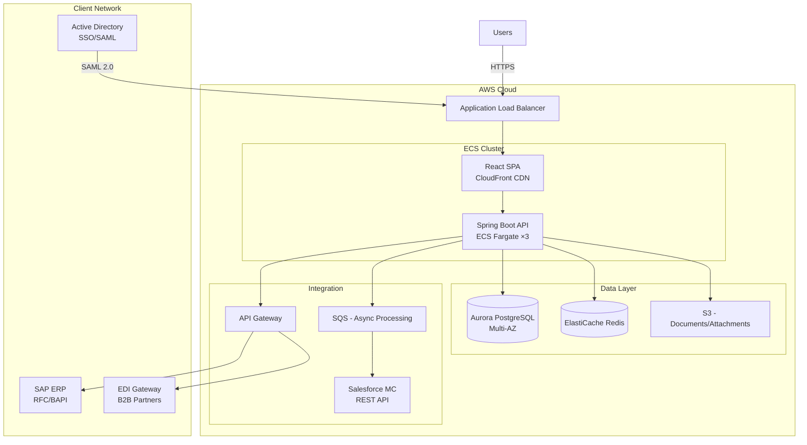

# IT Consulting Expert Plugin — Dry Run Results
# ITコンサルティングエキスパートプラグイン — ドライラン結果

## Standard Scenario
## 標準シナリオ

**Client**: ABC Manufacturing Corp (ABC製造株式会社)
**Industry**: Large Japanese manufacturer (大企業製造業、東京都、従業員3,000名)
**Project**: Legacy on-premise CRM system migration to cloud-based CRM (レガシーオンプレミスCRMシステムのクラウド型CRMへの移行)
**RFP Budget Indication**: ~¥200,000,000 (RFP予算感: 約2億円)
**Timeline Expectation**: 18 months from contract signing (期待されるスケジュール: 契約締結から18ヶ月)
**Submission Deadline**: 2026/07/31 (提出期限: 2026年7月31日)
**Presentation Date**: 2026/08/15 (プレゼンテーション日: 2026年8月15日)
**Contract Type**: Fixed-price (一括請負)

### Simulated RFP Key Requirements (シミュレーションRFPの主な要件)
- Migrate 500K customer records from legacy Oracle-based CRM (レガシーOracleベースのCRMから50万件の顧客データを移行)
- Web + mobile interface for 800 internal sales/support users (800名の社内営業/サポートユーザー向けのWeb＋モバイルインターフェース)
- Integration with SAP ERP (existing), Salesforce Marketing Cloud, and EDI partners (既存SAP ERP、Salesforce Marketing Cloud、およびEDIパートナーとの連携)
- 99.9% availability SLA, < 2 second response time (99.9%の可用性SLA、2秒以内の応答時間)
- ISMS/ISO27001 compliance required (ISMS/ISO27001準拠必須)
- Waterfall methodology preferred (ウォーターフォール手法推奨)
- On-premise or hybrid cloud (AWS preferred, Azure acceptable) (オンプレミスまたはハイブリッドクラウド - AWS推奨、Azure許容)

---

## Skill 1: RFP Analysis (案件評価・提案可否判断)

**Trigger**: "Should we bid on this ABC Manufacturing CRM RFP?" (トリガー：「このABC製造のCRM RFPに応札すべきか？」)

### Output (出力)

**Deal Summary (案件概要)**

| Field | Value |
|-------|-------|
| Client (クライアント) | ABC Manufacturing Corp (ABC製造株式会社) |
| Project (プロジェクト) | CRM Migration to Cloud (CRMのクラウド移行) |
| Estimated Value (予想金額) | ¥200,000,000 (2億円) |
| Submission Deadline (提出期限) | 2026/07/31 (2026年7月31日) |
| Contract Type (契約タイプ) | Fixed-price (一括請負) |
| Duration (期間) | 18 months (18ヶ月) |

**Dimension Scoring (評価ディメンションスコアリング)**

| Dimension (評価軸) | Score (1-5) | Weight (ウェイト) | Weighted (加重スコア) | Assessment (評価) |
|-----------|-------------|--------|----------|------------|
| Strategic Fit (戦略適合性) | 4 | 15% | 0.60 | 製造業はターゲット業界。追加案件の可能性（保守、フェーズ2のモバイル化）を持つ大口顧客。 |
| Capability Match (技術適合性) | 4 | 25% | 1.00 | クラウド移行、CRM、SAP連携に強みあり。EDIにわずかなギャップがあるが、パートナーで補完可能。 |
| Win Probability (受注確度) | 3 | 25% | 0.75 | 既存ベンダーの優位性なし。公平な競争環境。当社のSAP連携の実績が差別化要因となる。 |
| Commercial Viability (収益性) | 3 | 20% | 0.60 | 見積り通りであれば2億円の一括請負で約18%の利益率が確保可能。データ移行のリスクプレミアムが必要。 |
| Risk Profile (リスク) | 3 | 15% | 0.45 | 50万件のデータ移行は中程度のリスク。レガシーOracleシステムには文書化されていないビジネスロジックが存在する可能性あり。 |
| **Total (合計)** | | **100%** | **3.40** | |

**Go/No-Go Recommendation: GO (条件付き)** (提案可否の推奨：GO（条件付き）)

Conditions (条件):
1. Confirm EDI partner availability before commitment (コミット前にEDIパートナーの稼働可能状況を確認する)
2. Request pre-proposal client meeting to assess legacy system data quality (レガシーシステムのデータ品質を評価するため、提案前にクライアントミーティングを要請する)
3. Budget 20% risk contingency for data migration unknowns (データ移行の未知のリスクに備え、20%のリスク予備費を予算化する)
4. Assign senior PM with manufacturing sector experience (製造業の経験があるシニアPMをアサインする)

**Proposal Investment Estimate**: 3 weeks, 4 senior staff = ~6人月 proposal effort (提案投資見積り：3週間、シニアスタッフ4名 ＝ 約6人月の提案工数)

---

## Skill 2: Create Proposal (提案書作成)

**Trigger**: "Create a proposal for the ABC Manufacturing CRM RFP" (トリガー：「ABC製造のCRM RFP向けの提案書を作成して」)

### Output (Document Structure) (出力 - ドキュメント構成)

**提案書 — ABC製造株式会社 御中**
**顧客関係管理システム クラウド移行プロジェクト ご提案書**

**1. ご提案概要 (Executive Summary)**

ABC製造様の現行CRMシステムをクラウド基盤へ移行し、営業・サポート800名の業務効率を向上させるソリューションをご提案いたします。AWS基盤上にモダンWebアプリケーションを構築し、SAP ERP連携・EDIパートナー連携を維持しながら、99.9%の可用性と2秒以内の応答性能を実現します。

| 項目 | 内容 |
|------|------|
| プロジェクト期間 | 18ヶ月 (2026/10 — 2028/03) |
| 総工数 | 132人月 |
| ご提案金額 | ¥198,000,000 (税別) |
| 開発方法論 | ウォーターフォール |
| 体制 | 15名 (ピーク時) |

**2. お客様の課題認識 (Understanding of Client Needs)**
- [RFP] 現行Oracle CRMの保守期限切れに伴うリスク
- [RFP] 営業現場からのモバイルアクセス要望
- [RFP] SAP ERPとのリアルタイム連携維持の必要性
- [Proposed] レガシーデータのクレンジングによる顧客データ品質の向上

**3. ご提案ソリューション (Proposed Solution)**
- AWS上のコンテナ基盤 (ECS/Fargate)
- React + TypeScript フロントエンド (レスポンシブ対応)
- Java Spring Boot バックエンド (API Gateway経由)
- PostgreSQL (Aurora) + Redis キャッシュ
- SAP連携: RFC/BAPI via SAP Cloud Connector
- 50万件データ移行: ETLツール + カスタムバリデーション

**4-10. (Additional sections as per proposal-format.md template) (proposal-format.mdテンプレートに沿った追加セクション)**
- 技術アーキテクチャ、プロジェクト体制、工数・コスト、スケジュール、品質管理計画、リスク管理、保守運用提案

---

## Skill 3: Team Composition (チーム構成)

**Trigger**: "Propose a team for the ABC Manufacturing CRM project" (トリガー：「ABC製造のCRMプロジェクトのチームを提案して」)

### Output (出力)

**Team Structure (プロジェクト体制図)**

```
[ABC Manufacturing] (ABC製造)
├── Client PM (情報システム部 部長)
├── Client Business Owners (営業部, CS部)
└── Client IT Staff (2名, 既存システム知見)

[Our Company — Prime Contractor] (当社 - 元請け)
├── Project Manager (PM) ×1 — シニア, 経験12年, 製造業
├── Technical Lead (TL) ×1 — シニア, 経験10年, AWS + Javaアーキテクト
├── Business Analyst (BA) ×1 — ミドル〜シニア, CRMドメインの専門知識
├── System Engineer (SE) ×3 — ミドル, Java/React開発
├── Programmer (PG) ×3 — ミドル〜ジュニア, 実装
├── QA Engineer ×2 — ミドル, テスト自動化
├── Infrastructure Engineer ×1 — シニア, AWS認定
├── Data Migration Specialist ×1 — ミドル〜シニア, ETL + Oracle
└── UX/UI Designer ×1 — ミドル, レスポンシブデザイン

[Subcontractor — EDI Partner] (協力会社 - EDIパートナー)
└── EDI Integration Engineer ×1 — シニア, EDI/B2Bゲートウェイ
```

**Staffing Summary (要員計画の概要)**

| Role (役割) | Count (人数) | Seniority (経験レベル) | Monthly Rate (月額単価 ¥) | Ramp-Up (参画月) | Duration (期間) |
|------|-------|-----------|------------------|---------|----------|
| PM | 1 | エキスパート (15年) | 1,800,000 | 1ヶ月目 | 18ヶ月 |
| TL | 1 | シニア (10年) | 1,300,000 | 1ヶ月目 | 18ヶ月 |
| BA | 1 | ミドル〜シニア (8年) | 1,000,000 | 1ヶ月目 | 12ヶ月 |
| SE | 3 | ミドル (平均5年) | 800,000 | 2ヶ月目 | 14ヶ月 |
| PG | 3 | ミドル〜ジュニア (3年) | 600,000 | 4ヶ月目 | 10ヶ月 |
| QA | 2 | ミドル (5年) | 650,000 | 6ヶ月目 | 10ヶ月 |
| Infra | 1 | シニア (8年) | 1,100,000 | 1ヶ月目 | 16ヶ月 |
| Data Migration | 1 | ミドル〜シニア (7年) | 950,000 | 3ヶ月目 | 8ヶ月 |
| UX/UI | 1 | ミドル (4年) | 750,000 | 1ヶ月目 | 8ヶ月 |
| EDI Eng (Sub) | 1 | シニア (10年) | 1,000,000 | 8ヶ月目 | 6ヶ月 |
| **Total (合計)** | **15** | | | | |

**Seniority Mix**: Senior 27% / Mid 46% / Junior 27% — within recommended range. (経験レベルの割合: シニア27% / ミドル46% / ジュニア27% — 推奨範囲内)

---

## Skill 4: Effort Estimation (工数見積)

**Trigger**: "Estimate effort for the CRM migration project" (トリガー：「CRM移行プロジェクトの工数を見積もって」)

### Output (出力)

**Method (手法)**: WBS-based (工数積み上げ) — appropriate for fixed-price SIer contract. (固定価格のSIer契約に適している)

**WBS Summary by Phase (フェーズ別WBS概要)**

| Phase (フェーズ) | Japanese (日本語) | Man-Months (人月) | Duration (期間) | % of Total (全体比率) |
|-------|----------|-----------|----------|------------|
| Requirements Definition | 要件定義 | 12.0 | 2.5 months (2.5ヶ月) | 11% |
| Basic Design | 基本設計 | 18.0 | 3.0 months (3.0ヶ月) | 16% |
| Detailed Design | 詳細設計 | 16.0 | 2.5 months (2.5ヶ月) | 14% |
| Implementation | 製造 | 28.0 | 3.5 months (3.5ヶ月) | 25% |
| Integration Testing | 結合テスト | 14.0 | 2.0 months (2.0ヶ月) | 13% |
| System Testing | 総合テスト | 12.0 | 2.0 months (2.0ヶ月) | 11% |
| Deployment & Migration | 移行・リリース | 6.0 | 1.5 months (1.5ヶ月) | 5% |
| **Subtotal (小計)** | | **106.0** | | |
| PM Overhead (15%) | PM工数 | 16.0 | 18 months (18ヶ月) | — |
| Risk Buffer (10%) | バッファ | 10.0 | — | — |
| **Grand Total (総計)** | | **132.0人月** | **18 months (18ヶ月)** | **100%** |

**Key Estimation Drivers (from RFP) (見積りの主な要因（RFPより）)**
- 500K record data migration (50万件のデータ移行): +8人月 (複雑なクレンジング/検証)
- SAP ERP integration (RFC/BAPI) (SAP ERP連携): +6人月 (3つの連携ポイント)
- EDI partner integration (EDIパートナー連携): +4人月 (2つのEDIフォーマット)
- Mobile responsive UI (モバイルレスポンシブUI): +4人月 (追加のテスト/デザイン)
- ISMS compliance documentation (ISMS準拠ドキュメント): +3人月

**Adjustment Factors Applied (適用された調整係数)**
| Factor (要因) | Multiplier (乗数) | Rationale (根拠) |
|--------|-----------|-----------|
| Technology maturity (技術の成熟度) | 1.0 | 実証済みのスタック (Java, React, AWS) |
| Team experience (チームの経験) | 0.95 | 経験豊富なチーム、類似の過去プロジェクトあり |
| Requirements stability (要件の安定性) | 1.10 | レガシーシステムには文書化されていないルールが存在する可能性あり |
| Integration complexity (連携の複雑さ) | 1.15 | SAP + EDI + Marketing Cloud |
| **Combined (総合)** | **1.07** | 基本見積りに適用 |

---

## Skill 5: Cost Estimation (費用見積)

**Trigger**: "Calculate cost for the CRM project" (トリガー：「CRMプロジェクトの費用を計算して」)

### Output (出力)

**Labor Cost Breakdown (人件費内訳)**

| Role (役割) | Monthly Rate (月額単価 ¥) | Man-Months (人月) | Subtotal (小計 ¥) |
|------|-----------------|-----------|--------------|
| PM (Expert) | 1,800,000 | 18.0 | 32,400,000 |
| TL (Senior) | 1,300,000 | 18.0 | 23,400,000 |
| BA (Mid-Senior) | 1,000,000 | 12.0 | 12,000,000 |
| SE ×3 (Mid) | 800,000 | 42.0 | 33,600,000 |
| PG ×3 (Mid-Junior) | 600,000 | 30.0 | 18,000,000 |
| QA ×2 (Mid) | 650,000 | 20.0 | 13,000,000 |
| Infra (Senior) | 1,100,000 | 16.0 | 17,600,000 |
| Data Migration (Mid-Senior) | 950,000 | 8.0 | 7,600,000 |
| UX/UI (Mid) | 750,000 | 8.0 | 6,000,000 |
| EDI Eng — Sub (Senior) | 1,000,000 | 6.0 | 6,000,000 |
| **Labor Total (人件費合計)** | | **178.0** | **¥169,600,000** |

**Non-Labor Costs (非人件費)**

| Category (カテゴリ) | Monthly (月額 ¥) | Duration (期間) | Total (合計 ¥) |
|----------|------------|----------|-----------|
| AWS (dev/staging/prod) | 600,000 | 18 months (18ヶ月) | 10,800,000 |
| CI/CD + monitoring tools | 100,000 | 18 months (18ヶ月) | 1,800,000 |
| Licenses (dev tools, IDE) | 50,000 | 18 months (18ヶ月) | 900,000 |
| Travel (出張費) | — | — | 2,000,000 |
| Data migration tools (データ移行ツール) | — | lump sum (一括) | 1,500,000 |
| **Non-Labor Total (非人件費合計)** | | | **¥17,000,000** |

**Cost Summary (費用サマリー)**

| Item (項目) | Amount (金額 ¥) |
|------|-----------|
| Labor Cost (人件費) | 169,600,000 |
| Non-Labor Cost (非人件費) | 17,000,000 |
| **Total Cost (総原価)** | **186,600,000** |
| Risk Premium (6%) (リスクプレミアム) | 11,400,000 |
| **Proposed Price (提案価格)** | **¥198,000,000** |
| **Gross Margin (粗利益率)** | **5.8%** |

**Note**: Margin is thin for fixed-price. Mitigation: negotiate scope boundaries clearly at contract signing, ensure CR process for any additions beyond RFP scope.
(注記: 一括請負としては利益率が低い。対策：契約締結時にスコープの境界を明確に交渉し、RFPのスコープを超える追加については変更管理（CR）プロセスを確実に行うこと。)

**RFP Budget Fit**: ¥198M vs. client indication of ¥200M — within budget with ¥2M headroom.
(RFP予算への適合性: 1億9,800万円（クライアントの提示額2億円に対し） — 200万円の余裕を残し予算内に収まる。)

---

## Skill 6: Technical Solution (技術提案)

**Trigger**: "Design the technical solution for ABC Manufacturing CRM" (トリガー：「ABC製造のCRM向けの技術ソリューションを設計して」)

### Output (出力)

**Solution Architecture Overview (ソリューションアーキテクチャの概要)**



**Technology Stack Selection (技術スタックの選定)**

| Layer (レイヤー) | Selected (選定技術) | RFP Requirement (RFP要件) | Rationale (根拠) |
|-------|----------|-----------------|-----------|
| Cloud (クラウド) | AWS | AWS推奨 [RFP] | クライアントの希望。当社のAWSアドバンストパートナーとしての実績。 |
| Frontend (フロントエンド) | React 18 + TypeScript | レスポンシブWeb＋モバイル [RFP] | コンポーネントエコシステム、モバイルレスポンシブ対応、チームの専門知識。 |
| Backend (バックエンド) | Java 21 + Spring Boot 3 | 指定なし | SAP連携の成熟度、エンタープライズグレード、豊富な人材プール。 |
| Database (データベース) | Aurora PostgreSQL | 指定なし (レガシーはOracle) | コスト効率が高く、AWSネイティブで、優れたパフォーマンスを発揮する。 |
| Cache (キャッシュ) | ElastiCache Redis | 2秒以内の応答 [RFP] | 頻繁にアクセスされる顧客データのミリ秒以下の読み取り。 |
| Auth (認証) | AWS Cognito + SAML | Active Directory SSO [RFP] | クライアントのADとのネイティブSAML連携。 |
| Integration (連携) | AWS API Gateway + SQS | SAP, EDI, SFMC [RFP] | スロットリングを備えたマネージドAPIゲートウェイ。非クリティカルパス向けの非同期処理。 |

**NFR Compliance (非機能要件の遵守)**

| Requirement (要件) | RFP Target (RFP目標) | Solution Design (ソリューション設計) | Achieved (達成) |
|------------|-----------|----------------|----------|
| Availability (可用性) | 99.9% | マルチAZ Aurora + ECSオートスケーリング | はい |
| Response Time (応答時間) | 2秒以内 | Redisキャッシュ + CDN + クエリ最適化 | はい |
| Security (セキュリティ) | ISMS/ISO27001 | WAF、保存中/通信中の暗号化、VPC分離 | はい |
| Data Migration (データ移行) | 50万件のレコード | 検証＋ロールバック機能を備えたETLパイプライン | はい |
| Scalability (スケーラビリティ) | 同時ユーザー800名 | ECSオートスケーリング（3〜10コンテナ） | はい |

---

## Skill 7: Project Delivery (プロジェクト計画)

**Trigger**: "Plan the project delivery methodology" (トリガー：「プロジェクトのデリバリー手法を計画して」)

### Output (出力)

**Methodology (方法論)**: Waterfall (ウォーターフォール) — per RFP requirement. (RFPの要件に従う)

**Phase Plan (フェーズ計画)**

| Phase (フェーズ) | Japanese (日本語) | Start (開始) | End (終了) | Duration (期間) | Gate Criteria (ゲート基準) |
|-------|----------|-------|-----|----------|---------------|
| Requirements | 要件定義 | 2026/10 | 2026/12 | 2.5M (ヶ月) | 要件定義書がクライアントによって承認されること |
| Basic Design | 基本設計 | 2027/01 | 2027/03 | 3.0M (ヶ月) | 基本設計書＋アーキテクチャレビュー |
| Detailed Design | 詳細設計 | 2027/04 | 2027/06 | 2.5M (ヶ月) | 詳細設計書＋DB設計のフリーズ |
| Implementation | 製造 | 2027/05 | 2027/08 | 3.5M (ヶ月) | コード完成＋単体テスト合格 |
| Integration Test | 結合テスト | 2027/09 | 2027/10 | 2.0M (ヶ月) | IT報告書＋欠陥のクローズ |
| System Test | 総合テスト | 2027/11 | 2027/12 | 2.0M (ヶ月) | クライアントによるUATサインオフ |
| Data Migration | データ移行 | 2028/01 | 2028/02 | 1.5M (ヶ月) | 移行検証の完了 |
| Go-live | 本番稼働 | 2028/03 | 2028/03 | 0.5M (ヶ月) | 本番稼働チェックリスト＋ハイパーケア（初期流動管理） |

**Governance Structure (ガバナンス体制)**

| Meeting (会議) | Frequency (頻度) | Participants (参加者) | Purpose (目的) |
|---------|-----------|-------------|---------|
| Steering Committee (経営報告) | 月次 | PM, クライアント側ディレクター, スポンサー | 戦略的決定、エスカレーション |
| Progress Meeting (進捗会議) | 週次 | PM, TL, クライアント側PM | 状況レビュー、課題解決 |
| Technical Review (技術レビュー) | フェーズゲート毎 | TL, アーキテクト, クライアントIT | アーキテクチャ/設計の承認 |
| Quality Review (品質会議) | 隔週 (テスト期間) | QAリード, PM, クライアント側QA | 欠陥の傾向、テストの進捗 |

**Deliverables per Phase**: (Per deliverables-template.md — 32 documents total across all phases)
(フェーズごとの成果物: deliverables-template.md に従う — 全フェーズで合計32のドキュメント)

---

## Skill 8: Proposal Presentation (提案プレゼン資料)

**Trigger**: "Create a presentation for the proposal defense" (トリガー：「提案プレゼン用の資料を作成して」)

### Output (出力)

**Presentation Plan (プレゼンテーション計画)** — 20 minutes + 10 minutes Q&A (20分＋質疑応答10分)

| Slide # (スライド番号) | Title (タイトル) | Time (時間) | Key Message (キーメッセージ) |
|---------|-------|------|-------------|
| 1 | 表紙 | — | ABC製造株式会社 御中 — CRMクラウド移行ご提案 |
| 2 | 本日のご説明内容 | 1分 | 評価基準の順序に合わせたアジェンダ |
| 3 | ご提案の概要 | 2分 | 課題 → 解決策 → 18ヶ月/1.98億円 → フルインテグレーションを備えたクラウドCRM |
| 4-5 | お客様の課題認識 | 3分 | レガシーEOLリスク、モバイルアクセスのギャップ、データのサイロ化 — RFPから引用 |
| 6-8 | ご提案ソリューション | 5分 | アーキテクチャ図、技術スタック、SAP連携のアプローチ |
| 9 | プロジェクトアプローチ | 2分 | ウォーターフォールフェーズ、品質ゲート、リスク管理 |
| 10 | プロジェクト体制 | 2分 | 組織図、主要人員のプロフィール |
| 11 | スケジュール | 1分 | 18ヶ月のガントチャート、主要マイルストーン |
| 12 | お見積概要 | 1分 | フェーズごとの1.98億円の内訳 |
| 13 | 当社の強み | 2分 | 製造業向けCRMの実績、SAPパートナーシップ、AWS認定 |
| 14 | リスク対策 | 1分 | トップ3のリスクとその対策 — 先を見越した対応をアピール |
| 15 | 次のステップ | 1分 | 契約 → キックオフのタイムライン、直近のアクション |

**Anticipated Q&A (想定質疑応答)**

| # | Expected Question (想定される質問) | Prepared Answer (用意した回答) |
|---|------------------|----------------|
| 1 | "Why PostgreSQL instead of Oracle?" (なぜOracleではなくPostgreSQLなのか？) | コストを約40%削減。Aurora PostgreSQLのパフォーマンスはすべての非機能要件を満たし、移行ツールも成熟しているため。 |
| 2 | "How do you handle data migration risk?" (データ移行のリスクにどう対応するか？) | 3フェーズアプローチ：試験移行 → 検証 → ロールバック計画を伴う本番移行。 |
| 3 | "What if the 18-month timeline slips?" (18ヶ月のスケジュールが遅延した場合は？) | 10%のバッファを組み込み、並行テストトラックを用意。フェーズゲートでの早期エスカレーショントリガーを設定。 |
| 4 | "Why not Salesforce CRM?" (なぜSalesforce CRMではないのか？) | RFPでカスタム開発が指定されている。Salesforceのライセンスは予算を超える。カスタム開発によりSAP連携を完全にコントロールできるため。 |
| 5 | "Subcontractor quality control?" (協力会社の品質管理は？) | 成果物を定義した単一のEDIスペシャリストを配置。元請けがすべてのコードのQAレビューを実施する。 |

---

## Skill 9: Design Presentation (Claude Design連携プレゼン)

**Trigger**: "Design the presentation visually in Claude Design" (トリガー：「Claude Designを使って視覚的にプレゼンテーションをデザインして」)

### Output (出力)

**Design System (デザインシステム)**

| Element (要素) | Value (値) |
|---------|-------|
| Impression (印象) | Conservative/Trustworthy (保守的/信頼感 - 製造業向け) |
| Primary Color (プライマリカラー) | Navy #1a365d (ネイビー) |
| Secondary Color (セカンダリカラー) | Slate #334155 (スレート) |
| Accent Color (アクセントカラー) | Blue #3b82f6 (ブルー) |
| Typography (JP) (タイポグラフィ-日本語) | Noto Sans JP |
| Typography (EN) (タイポグラフィ-英語) | Inter |
| Slide Dimensions (スライドサイズ) | 1280 × 720px (16:9) |

**15 HTML Slides Generated (15枚のHTMLスライドを生成)** — self-contained single HTML file with (以下の内容を含む自己完結型の単一HTMLファイル):
- Header bar: navy gradient with project title (ヘッダーバー: プロジェクトタイトル入りのネイビーグラデーション)
- Footer: page number + company logo (フッター: ページ番号＋会社ロゴ)
- Content area: 1200 × 590px (コンテンツエリア: 1200 × 590px)
- Architecture diagrams rendered as inline SVG (インラインSVGとしてレンダリングされたアーキテクチャ図)
- Gantt chart rendered as CSS grid (CSSグリッドでレンダリングされたガントチャート)
- Team org chart as hierarchical SVG (階層型SVGとしてのチーム組織図)
- Data tables with alternating row colors (行の色が交互に変わるデータテーブル)

**Export Options (エクスポートオプション)**:
1. Deploy to Vercel via `import-claude-design-from-url` for client preview (クライアントプレビュー用に `import-claude-design-from-url` 経由でVercelにデプロイ)
2. Export to PDF for email attachment (メール添付用にPDFにエクスポート)
3. Convert to .pptx via the `pptx` skill for editable slides (編集可能なスライド用に `pptx` スキルで.pptxに変換)

---

## Skill 10: Progress Report (進捗報告書)

**Trigger**: "Create a weekly status report" (simulated: Month 5, Basic Design phase) (トリガー：「週次ステータスレポートを作成して」 - シミュレーション：5ヶ月目、基本設計フェーズ)

### Output (出力)

**週次進捗報告書**

| Field (項目) | Value (内容) |
|-------|-------|
| Project (プロジェクト) | ABC Manufacturing CRM Migration (ABC製造 CRM移行) |
| Reporting Period (報告期間) | 2027/02/17 — 2027/02/21 |
| Current Phase (現在のフェーズ) | Basic Design (基本設計) |
| Overall Status (全体ステータス) | 🟡 Yellow (イエロー) |
| Report Date (報告日) | 2027/02/21 |
| Author (作成者) | PM Tanaka |

**Overall Status Dashboard (全体ステータスダッシュボード)**

| Area (領域) | Status (ステータス) | Trend (傾向) | Comment (コメント) |
|------|--------|-------|---------|
| Schedule (スケジュール) | 🟡 | → | クライアントのフィードバックループにより、画面設計が3日遅延 |
| Quality (品質) | 🟢 | → | デザインレビュー合格率92% |
| Cost (コスト) | 🟢 | → | 予算内 (SPI: 0.97, CPI: 1.02) |
| Risk (リスク) | 🟡 | ↑ | 新たなリスク：クライアント側からのSAPインターフェース仕様提供の遅れ |
| Scope (スコープ) | 🟢 | → | 今期の変更要求はなし |

**This Week's Accomplishments (今週の成果)**
- Completed DB logical design (30 tables, reviewed by TL) (DB論理設計完了 - 30テーブル、TLによるレビュー済み)
- Completed 18/25 screen designs (72%) (25画面中18画面の設計完了 - 72%)
- SAP integration API design: 2/3 interfaces drafted (SAP連携API設計: 3つのインターフェース中2つのドラフト作成)
- Client workshop: confirmed 15 business rules for order management module (クライアントワークショップ: 注文管理モジュールの15のビジネスルールを確認)

**Next Week's Plan (来週の計画)**
- Complete remaining 7 screen designs (残り7画面の設計を完了する)
- SAP interface specification review with client IT (クライアントITとSAPインターフェース仕様をレビューする)
- Begin integration design for EDI gateway (EDIゲートウェイの連携設計を開始する)
- Phase gate preparation (基本設計レビュー target: 2027/03/05) (フェーズゲートの準備 - 基本設計レビューの目標: 2027/03/05)

**Open Issues (未解決の課題)**

| # | Issue (課題) | Owner (担当者) | Priority (優先度) | Due (期限) | Status (ステータス) |
|---|-------|-------|----------|-----|--------|
| ISS-012 | SAP BAPI documentation incomplete from client (クライアントからのSAP BAPIドキュメントが不完全) | Client PM (クライアント側PM) | High (高) | 02/28 | Waiting (待ち状態) |
| ISS-015 | Mobile screen breakpoint specs need UX revision (モバイル画面のブレークポイント仕様についてUXの修正が必要) | UX Designer (UXデザイナー) | Medium (中) | 02/25 | In Progress (対応中) |

**Decisions Needed from Client (クライアントに求める決定事項)**
1. Approve DB logical design by 02/28 to maintain schedule (スケジュール維持のため、02/28までにDB論理設計を承認すること)
2. Provide SAP BAPI documentation for remaining 3 interfaces (残り3つのインターフェースに関するSAP BAPIドキュメントを提供すること)

---

## Skill 11: Change Request (変更管理)

**Trigger**: "Create a change request for adding a dashboard feature" (simulated: Month 8) (トリガー：「ダッシュボード機能追加の変更要求を作成して」 - シミュレーション：8ヶ月目)

### Output (出力)

**変更依頼書 (Change Request)**

| Field (項目) | Value (内容) |
|-------|-------|
| CR Number (CR番号) | CR-ABCCRM-2027-003 |
| Date (日付) | 2027/05/15 |
| Requester (依頼者) | ABC Manufacturing — Sales Director (ABC製造 - 営業部長) |
| Origin (発生元) | Client Request (クライアントからの要求) |
| Priority (優先度) | Medium (中) |
| Current Phase (現在のフェーズ) | Implementation (製造) |

**Change Description (変更の概要)**:
Add a real-time sales analytics dashboard with 5 KPI widgets (monthly revenue, pipeline, conversion rate, top customers, regional breakdown). Not in original RFP scope.
(5つのKPIウィジェット（月次収益、パイプライン、コンバージョン率、上位顧客、地域別内訳）を備えたリアルタイム販売分析ダッシュボードを追加する。元のRFPのスコープ外。)

**Impact Analysis (影響分析)**

| Dimension (評価軸) | Impact (影響) |
|-----------|--------|
| Schedule (スケジュール) | +15 working days (3 weeks) (+15営業日（3週間）) |
| Cost (コスト) | +¥4,200,000 (3.0人月: 1.0設計 + 1.5開発 + 0.5テスト) |
| Quality (品質) | +12 additional test cases; no regression risk to existing modules (追加で12のテストケース。既存モジュールへのデグレリスクなし) |
| Scope (スコープ) | New module (Dashboard); no modification to existing approved design (新規モジュール（ダッシュボード）。既存の承認済み設計への変更なし) |
| Risk (リスク) | Low — isolated feature, no integration dependencies (低 — 独立した機能であり、連携の依存関係なし) |

**Cost Breakdown (コスト内訳)**

| Category (カテゴリ) | Effort (工数) | Rate (単価) | Cost (費用) |
|----------|--------|------|------|
| Screen Design (画面設計) | 0.5人月 | ¥800,000 | ¥400,000 |
| API Design (API設計) | 0.5人月 | ¥800,000 | ¥400,000 |
| Frontend Dev (フロントエンド開発) | 0.8人月 | ¥800,000 | ¥640,000 |
| Backend Dev (aggregation queries) (バックエンド開発 - 集計クエリ) | 0.7人月 | ¥800,000 | ¥560,000 |
| Testing (テスト) | 0.5人月 | ¥650,000 | ¥325,000 |
| **Total (合計)** | **3.0人月** | | **¥4,200,000** (税別) |

**Recommendation: APPROVE** — isolated scope, reasonable cost, high client value. Schedule impact absorbable within existing buffer (7 days consumed of 15-day buffer).
(推奨：承認 — 独立したスコープ、妥当なコスト、高い顧客価値。スケジュールの影響は既存のバッファ内で吸収可能（15日間のバッファのうち7日間を消費）。)

**Approval Required (必要な承認)**: Project Director (schedule impact < 1 month, cost < ¥5M threshold) (プロジェクトディレクター — スケジュール影響1ヶ月未満、コスト500万円未満のしきい値のため)

---

## Skill 12: Vendor Management (協力会社管理)

**Trigger**: "Set up vendor management for the EDI subcontractor" (トリガー：「EDIの協力会社向けのベンダー管理を設定して」)

### Output (出力)

**Multi-Company Organization (複数企業間の組織体制)**

```
[ABC Manufacturing — Client] (ABC製造 — クライアント)
├── Client PM (情報システム部 課長)
└── Client Business Users (クライアントのビジネスユーザー)

[Our Company — Prime Contractor] (当社 — 元請け)
├── Project Director (プロジェクトディレクター)
├── PM
├── TL (code review authority over all code) (すべてのコードに対するコードレビュー権限を持つTL)
└── Development Team (12名) (開発チーム12名)

[TechBridge Co. — EDI Subcontractor] (TechBridge社 — EDI協力会社)
├── Sub-PM (窓口): Yamada-san (サブPM: 山田さん)
└── EDI Engineer ×1: Suzuki-san (EDIエンジニア: 鈴木さん)
```

**RACI Matrix (Key Activities) (RACIマトリックス - 主要アクティビティ)**

| Activity (アクティビティ) | Our PM (当社のPM) | Our TL (当社のTL) | Sub-PM (サブPM) | EDI Eng (EDIエンジニア) | Client PM (クライアントPM) |
|----------|--------|--------|--------|---------|-----------|
| EDI Requirements (EDI要件定義) | C | A | R | R | I |
| EDI Design (EDI設計) | I | A | C | R | I |
| EDI Implementation (EDI実装) | I | A | I | R | — |
| Code Review (コードレビュー) | I | A/R | I | I | — |
| Integration Testing (結合テスト) | A | C | R | R | I |
| Defect Fixing (欠陥修正) | I | A | C | R | — |
| Weekly Status (週次ステータス報告) | A/R | C | R | I | I |

**Quality Gates for Subcontractor (協力会社向けの品質ゲート)**

| Gate (ゲート) | Criteria (基準) | Reviewer (レビューア) |
|------|----------|----------|
| Design Review (設計レビュー) | アーキテクチャの整合性、API仕様への準拠 | Our TL (当社のTL) |
| Code Review (コードレビュー) | コーディング規約、セキュリティ、テストカバレッジ > 80% | Our TL (当社のTL) |
| Integration Test (結合テスト) | すべてのEDIシナリオに合格、エラー処理の確認 | Our QA Lead (当社のQAリード) |
| Acceptance (検収) | 本番EDIパートナーとのエンドツーエンドのデータフロー確認 | Client + Our PM (クライアント＋当社のPM) |

**Contract Type (契約タイプ)**: 請負契約 (Deliverable-based) — 6 months, ¥6,000,000 (請負契約（成果物ベース） — 6ヶ月、600万円)
**Key Clauses (主要条項)**: Re-delegation prohibited, IP ownership to prime contractor, 1-year defect warranty (再委託の禁止、元請けへのIP所有権の帰属、1年間の瑕疵担保責任)

---

## Skill 13: Maintenance Proposal (保守運用提案)

**Trigger**: "Create a maintenance proposal for post-go-live" (トリガー：「本番稼働後の保守運用提案を作成して」)

### Output (出力)

**保守運用ご提案書 — ABC製造株式会社 CRMシステム**

**Contract Overview (契約概要)**

| Item (項目) | Value (内容) |
|------|-------|
| Service Start (サービス開始) | 2028/04/01 (after 1-month hypercare) (1ヶ月のハイパーケア期間後) |
| Contract Duration (契約期間) | 3 years (annual renewal) (3年間（1年ごとの更新）) |
| Annual Fee (年間費用) | ¥30,000,000 (15% of project value) (プロジェクト総額の15%) |
| Support Hours (サポート対応時間) | Business hours: 9:00-18:00 JST, Mon-Fri (営業時間：月〜金曜 9:00〜18:00 JST) |
| Emergency: 24/7 for Severity 1 (緊急時：重要度1の場合は24時間365日対応) |

**SLA Definition (SLA定義)**

| Severity (重要度) | Definition (定義) | Response (応答時間) | Resolution (解決時間) | Penalty (ペナルティ) |
|----------|-----------|----------|-----------|---------|
| S1 (Critical) | システムダウン、全ユーザーに影響 | 30分 | 4時間 | SLA超過後 500,000円/時 |
| S2 (High) | 主要機能が利用不可、回避策あり | 2時間 | 8時間 | SLA超過後 200,000円/インシデント |
| S3 (Medium) | 軽微な機能の不具合、影響は限定的 | 4時間 | 3営業日 | なし |
| S4 (Low) | 表面的な問題、機能強化の要望 | 翌営業日 | 次回リリース時 | なし |

**Monthly Included Hours (月次基本対応時間)**

| Service Category (サービスカテゴリ) | Hours/Month (時間/月) | Scope (スコープ) |
|-----------------|-------------|-------|
| Corrective (障害対応) | Unlimited (within SLA) (SLA内無制限) | バグ修正、緊急パッチ |
| Adaptive (環境適応) | 10 hours (10時間) | OS/ミドルウェアの更新、セキュリティパッチ |
| Preventive (予防保守) | 8 hours (8時間) | モニタリング、ヘルスチェック、DRテスト |
| Perfective (改善保守) | 12 hours (12時間) | 軽微な機能強化、最適化 |
| **Total Included (基本対応合計)** | **~30 hours (約30時間)** | Additional hours: ¥15,000/hour (追加時間: 15,000円/時) |

**Team Structure (Maintenance) (チーム体制 - 保守)**

| Role (役割) | Allocation (稼働率) | Monthly Cost (月額費用) |
|------|-----------|-------------|
| Maintenance PM (保守PM) | 20% | ¥300,000 |
| Application Engineer (アプリケーションエンジニア) | 50% | ¥500,000 |
| Infrastructure Engineer (インフラエンジニア) | 30% | ¥360,000 |
| On-call rotation (off-hours) (オンコールローテーション - 時間外) | Shared pool (共有プール) | ¥200,000 |
| **Monthly Total (月額合計)** | | **¥1,360,000** |
| **Annual (年間合計)** | | **¥16,320,000** |

**Note**: Annual fee (¥30M) includes labor (¥16.3M) + AWS infrastructure management (¥10.8M) + tool licensing (¥0.9M) + margin (¥2.0M).
(注記: 年間費用（3,000万円）には、人件費（1,630万円）＋AWSインフラ管理（1,080万円）＋ツールライセンス（90万円）＋利益（200万円）が含まれる。)

---

## Skill 14: Lessons Learned (案件振り返り)

**Trigger**: "Conduct a project retrospective" (simulated: post go-live) (トリガー：「プロジェクトの振り返りを実施して」 - シミュレーション：本番稼働後)

### Output (出力)

**プロジェクト完了報告 兼 振り返り報告書**

**Planned vs. Actual Summary (計画と実績の比較サマリー)**

| Metric (指標) | Planned (計画) | Actual (実績) | Variance (差異) |
|--------|---------|--------|----------|
| Duration (期間) | 18 months (18ヶ月) | 19.5 months (19.5ヶ月) | +1.5 months (+8%) (+1.5ヶ月 (+8%)) |
| Effort (工数) | 132人月 | 145人月 | +13人月 (+10%) |
| Cost (コスト) | ¥198,000,000 | ¥205,000,000 | +¥7,000,000 (+3.5%) |
| CRs Approved (承認されたCR) | 0 | 3 | +¥8,500,000 revenue (+850万円の収益) |
| Defects (ST phase) (STフェーズの欠陥) | — | 47 (12 Critical, 35 Medium) (47件: 致命的12、中35) | Industry average (業界平均レベル) |
| Client Satisfaction (顧客満足度) | — | 4.2 / 5.0 | Good (良好) |

**Schedule Analysis (Phase) (フェーズ別スケジュール分析)**

| Phase (フェーズ) | Planned (計画) | Actual (実績) | Variance (差異) | Root Cause (根本原因) |
|-------|---------|--------|----------|------------|
| 要件定義 | 2.5M | 3.5M | +1.0M | レガシーシステムの文書化されていないビジネスルールにより、追加で15回のクライアントワークショップが必要になった |
| 基本設計 | 3.0M | 3.0M | 0 | — |
| 詳細設計 | 2.5M | 2.5M | 0 | — |
| 製造 | 3.5M | 4.0M | +0.5M | フェーズ途中でダッシュボードの変更要求(CR-003)が追加された |
| 結合テスト | 2.0M | 2.0M | 0 | — |
| 総合テスト | 2.0M | 2.5M | +0.5M | SAP連携の欠陥により、追加の回帰テストサイクルが必要になった |
| 移行・リリース | 1.5M | 2.0M | +0.5M | データ品質の問題により、データクレンジングに見積り以上の時間がかかった |

**KPT Analysis (KPT分析)**

**Keep (継続すべきこと)**
- Weekly client progress meetings built strong trust — client escalated to Yellow only once (週次のクライアント進捗会議により強固な信頼関係が築かれ、クライアントがイエローにエスカレーションしたのは1回のみだった)
- Data migration trial run at Month 12 caught 3 critical issues early (12ヶ月目に実施したデータ移行の試験運用により、致命的な問題を3件早期に発見できた)
- QA automation reduced regression test cycle from 5 days to 1 day (QAの自動化により、回帰テストサイクルが5日間から1日間に短縮された)

**Problem (問題点)**
- Requirements phase underestimated by 40% — legacy system had ~200 undocumented business rules (要件定義フェーズを40%過小見積もりしていた — レガシーシステムには約200の文書化されていないビジネスルールがあった)
- SAP BAPI documentation from client was incomplete, causing 2-week design delay (クライアントからのSAP BAPIドキュメントが不完全で、設計に2週間の遅れが生じた)
- Data quality in legacy Oracle was worse than assumed (15% duplicate records, 8% invalid data) (レガシーOracleのデータ品質が想定より悪かった（重複レコード15%、無効データ8%）)

**Try (次回への改善)**
- For legacy migration projects: budget 150% of standard requirements phase (レガシーシステム移行プロジェクトの場合：通常の要件定義フェーズの150%の予算を確保する)
- Request access to legacy system source code during proposal phase for complexity assessment (複雑さの評価のため、提案フェーズでレガシーシステムのソースコードへのアクセスを要求する)
- Include data quality audit as a paid pre-project activity (¥2-3M) (プロジェクト前の有償アクティビティとしてデータ品質監査を含める（200〜300万円）)
- Add "legacy system complexity" as a scoring dimension in Go/No-Go assessment (提案可否評価のスコアリング軸に「レガシーシステムの複雑さ」を追加する)

---

## Skill 15: Proposal Review (多角的レビューボード)

**Trigger**: "Review the proposal before submission" (トリガー：「提出前に提案書をレビューして」)

### Output (出力)

**Review Board Assessment (レビューボードによる評価)**

**Reviewer 1: Business Strategist (事業戦略レビューア)**
| Dimension (評価軸) | Score (1-5) | Finding (所見) |
|-----------|-------------|---------|
| Strategic Alignment (戦略的整合性) | 4 | 製造業のCRMは当社の得意分野であり、良いリファレンス顧客になる可能性がある。 |
| Commercial Viability (収益性) | 3 | 利益率5.8%は一括請負としては低い。CR（変更要求）が利益確保の鍵となる。 |
| Competitive Positioning (競争優位性) | 4 | SAP連携の経験が当社を差別化する。 |
| **Verdict (判定)** | **PASS with note (条件付き合格)** | 契約時にスコープの境界を厳密に交渉すること。利益率はそこにかかっている。 |

**Reviewer 2: Technical Architect (技術アーキテクトレビューア)**
| Dimension (評価軸) | Score (1-5) | Finding (所見) |
|-----------|-------------|---------|
| Architecture Soundness (アーキテクチャの妥当性) | 4 | ECS/Fargate + Auroraは堅牢である。Redisキャッシュは応答時間のNFRに対応している。 |
| Technology Risk (技術的リスク) | 3 | OracleからPostgreSQLへのデータ型マッピングについては、事前の詳細な分析が必要。 |
| Integration Feasibility (連携の実現可能性) | 4 | SAP Cloud Connectorは実績がある。協力会社を通じたEDIは適切。 |
| NFR Coverage (NFR網羅性) | 4 | すべての非機能要件(NFR)が具体的な技術ソリューションで対応されている。 |
| **Verdict (判定)** | **PASS (合格)** | 要件定義フェーズの計画にデータ型マッピングのスパイクテストを追加すること。 |

**Reviewer 3: QCD Controller (品質・コスト・納期レビューア)**
| Dimension (評価軸) | Score (1-5) | Finding (所見) |
|-----------|-------------|---------|
| Estimation Accuracy (見積りの正確性) | 3 | データ品質が不明な50万件のレコードに基づくデータ移行の工数は、過小に見積もられている可能性が高い。 |
| Timeline Realism (スケジュールの現実性) | 3 | SAP連携を含めて18ヶ月は厳しい。10%のバッファでは十分ではないかもしれない。 |
| Resource Feasibility (リソースの実現可能性) | 4 | チーム編成は強力である。主なリスクはPMの稼働状況（現在2つのプロジェクトを兼任中）。 |
| Testing Adequacy (テストの妥当性) | 4 | QA自動化が計画されている。パフォーマンステストの予算を追加することを推奨する。 |
| **Verdict (判定)** | **CONDITIONAL PASS (条件付き合格)** | データ移行の見積りを30%増額すること。パフォーマンステストツール用に150万円を追加すること。 |

**Reviewer 4: Client Perspective Analyst (顧客目線レビューア)**
| Dimension (評価軸) | Score (1-5) | Finding (所見) |
|-----------|-------------|---------|
| RFP Compliance (RFP準拠性) | 5 | すべての必須要件がトレーサビリティを持って対応されている。 |
| Trust Signals (信頼感) | 4 | 明確なリスク緩和策と関連する事例が示されている。 |
| Value Perception (価値の認識) | 4 | 予算上限である1.98億円は妥当だが、交渉の余地が残されていない。 |
| **Verdict (判定)** | **PASS (合格)** | クライアントとの交渉の余地を残すため、1.93億〜1.95億円での価格設定を検討すること。 |

**Reviewer 5: Risk Manager (リスク管理レビューア)**
| Dimension (評価軸) | Score (1-5) | Finding (所見) |
|-----------|-------------|---------|
| Risk Identification (リスク特定) | 4 | 主要なリスクは特定されている。レガシーデータ品質について正しくフラグが立てられている。 |
| Mitigation Quality (緩和策の品質) | 3 | データ移行の緩和計画には、ロールバックシナリオに関する詳細がさらに必要。 |
| Contractual Risk (契約上のリスク) | 3 | 利益率の低い一括請負契約であるため、違約金条項の慎重なレビューが必要。 |
| **Verdict (判定)** | **CONDITIONAL PASS (条件付き合格)** | データ移行に関する詳細なロールバック計画を追加すること。違約金の上限をレビューすること。 |

**Reviewer 6: Compliance Reviewer (コンプライアンスレビューア)**
| Dimension (評価軸) | Score (1-5) | Finding (所見) |
|-----------|-------------|---------|
| ISMS/ISO27001 | 4 | AWSのセキュリティコントロールはISMS要件にうまく対応している。 |
| Data Protection (データ保護) | 4 | 顧客のPII取り扱い計画は適切である。 |
| Subcontractor Compliance (協力会社のコンプライアンス) | 5 | EDIサブコンストラクターのNDAおよびセキュリティ条項は整備されている。 |
| **Verdict (判定)** | **PASS (合格)** | 問題なし。 |

**Consolidated Score: 3.8 / 5.0 — APPROVED FOR SUBMISSION (with revisions) (総合スコア：3.8 / 5.0 — 修正を条件に提出を承認)**

**Required Revisions Before Submission (提出前に必要な修正事項):**
1. Increase data migration estimate by +2.4人月 (QCD Controller) (データ移行の見積りを+2.4人月増額する (QCDコントローラー))
2. Add performance testing budget ¥1.5M (QCD Controller) (パフォーマンステスト予算150万円を追加する (QCDコントローラー))
3. Develop detailed data migration rollback plan (Risk Manager) (詳細なデータ移行ロールバック計画を策定する (リスクマネージャー))
4. Consider pricing at ¥193-195M for negotiation room (Client Perspective) (交渉の余地を持たせるため、1.93億〜1.95億円での価格設定を検討する (顧客目線アナリスト))
5. Add data type mapping spike to requirements phase plan (Technical Architect) (要件定義フェーズの計画にデータ型マッピングのスパイクを追加する (技術アーキテクト))

---

*Generated: 2026/06/21 — Dry run with simulated NotebookLM data* (生成: 2026/06/21 — シミュレーションされたNotebookLMデータによるドライラン)
*Plugin: it-consulting-expert v1.2.0* (プラグイン: it-consulting-expert v1.2.0)
